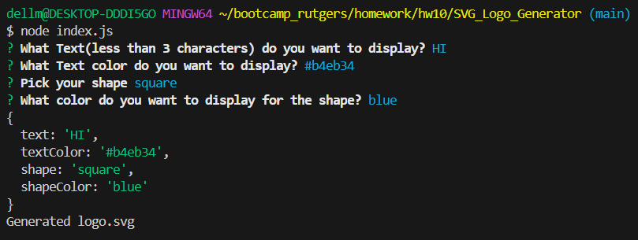

# SVG_Logo_Generator 
Created by Kendell Rennie
## Table of Contents 
- [Description](#description)
- [Installation](#installation)
- [Usage](#usage)
- [Tests](#tests)
- [License](#license)
- [Credits](#credits)
- [Questions](#questions)

## Description
Create a SVG image after the user enters the parameters.
## Installation
Clone the repository, and run npm i, run node index.js in the path with the index.js file
## Usage
You want to see how to use it:
https://drive.google.com/file/d/1zxBXS7UA5TbC6lWbG-YxVE7T8Ech4TGG/view

## Tests
type npm test
## Credits
### Collaborators
Kendell Rennie  
  
### Third-party-programs
inquirer  
 JEST  

## License
MIT
## Badges

## How to Contribute
If you like to contribute, my github username is dellman000

## Questions
If you have any questions, please contact me at kenren@udel.edu  
Link to my github profile page https://github.com/dellman000
 
    